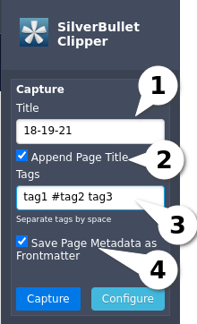
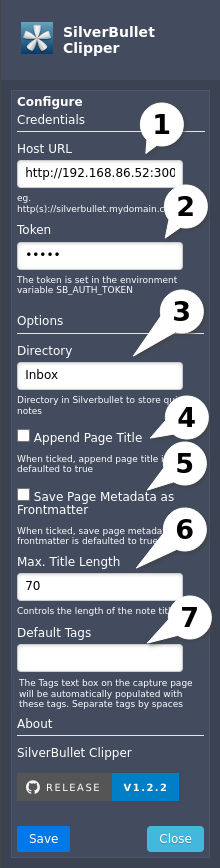

# SilverBullet Clipper - A web clipper for SilverBullet

[](https://github.com/davecburke/silverbullet-clipper/releases/latest)

[SilverBullet](https://silverbullet.md/) by Zef Hemel is an awesome note-taking application optimized for people with a hacker mindset.

SilverBullet Clipper is a browser extension that allows you to save either a URL or selected content from a page as markdown to SilverBullet. By default, the capture is added as a Quick Note in the default SilverBullet inbox. Please keep in mind that it is not guaranteed to work on all websites.

To use this add-on, simply click the extension icon while you are browsing the page you want to capture. If you've highlighted content on the page, the highlighted content will be saved to SilverBullet. If no content is highlighted, just the page URL will be saved to SilverBullet. A popup will allow you to change the page title from the default timestamp and add any tags that you want to the page.

# Installation

The extension is available for **Google Chrome** and **Opera** via the [Chrome Web Store](https://chromewebstore.google.com/detail/silverbullet-clipper/nkapoagmecfkneiaejccgkhffdmfmhki). The Firefox extension is available for both the **Firefox Desktop** and **Firefox for Android**. It can be added from [Firefox Browser Add-Ons](https://addons.mozilla.org/addon/silverbullet-clipper/)

[](https://chromewebstore.google.com/detail/silverbullet-clipper/nkapoagmecfkneiaejccgkhffdmfmhki)

[](https://addons.mozilla.org/addon/silverbullet-clipper/)

# Usage

## 1. The Capture Page



1. The title of the page as it will appear in SilverBullet. This mimics the title of a page created by the SilverBullet "Quick Note" button.
2. When the Append Page Title is selected, the web page title will be added to the title entered in (1.1). This is defaulted to off but can be defaulted to on via the configure page (2.4). The page title will be enclosed in brackets. Eg 18-19-21 (The Age Newspaper).
3. Multiple tags, separated by spaces, can be added to the page. The tags can be entered with or without a leading hash. For example, this is a valid entry: tag1 tag2 #tag3
4. When the Save Page Metadata as Frontmatter is selected, the page metadata is saved as frontmatter. This includes the tags. eg
```
---
source-title: 17-31-32 (UK elections- Celebrations will be short-liv...)
source-url: https://www.theage.com.au/world/europe/celebrations-will-be-short-lived-for-starmer-staring-down-britain-s-monumental-challenges-20240705-p5jra2.html
created-date: 2024-07-05
tags:
- uk
- election
---
```

## 2. The Configure Page



1. The host URL points to the instance of your SilverBullet installation. If you're running SilverBullet locally the URL will be something like http://192.168.86.54:3000. If you are running SilverBullet externally, or accessing it via a proxy, the host URL will be something like https://silverbullet.mydomain.com
2. The token will be whatever token you specified in the SB_AUTH_TOKEN environment variable.

   ### Command Line Example

   ```bash
   SB_USER=admin:mypassword SB_AUTH_TOKEN=mysuperlongtoken SB_HOSTNAME=0.0.0.0 /root/.deno/bin/silverbullet /root/Silverbullet/space
   ```

   ### Docker Compose Example

   ```bash
   services:
       silverbullet:
           image: zefhemel/silverbullet
           restart: unless-stopped
           environment:
           - SB_AUTH_TOKEN=mysuperlongtoken
           - SB_USER=admin:mypassword
           volumes:
           - ./space:/space
           ports:
           - 3000:3000
   ```

3. The directory is where your page will be created in SilverBullet. The default directory is Inbox as this is the directory that the SilverBullet Quick Note uses.
4. When the Append Page Title is selected, the Append Page Title check box on the Capture page (1.2) will default to selected.
5. When the Save Page Metadata as Frontmatter is selected, the Save Page Metadata as Frontmatter is selected check box on the Capture page (1.4) will default to selected.
6. The Max. Title Length determines how long the note's title will be. This is defaulted to 70 characters. If the note title exceeds this length, '...' will indicate that the title has been concatenated. Eg 2024-05-31 16:28:33 (The Age Newspaper Melbourne Aus...)
6. The tags text box on the capture page will be automatically populated with the default tags defined here. Multiple tags, separated by spaces, can be added to the default tags. The tags can be entered with or without a leading hash. For example, this is a valid entry: tag1 tag2 #tag3

# Build & Testing

## Instructions to Build the Extensions with Grunt

The extension is already built and can be found in the dist/chrome and dist/firefox folders. If you want to rebuild them the follow these instuctions:

- Prerequisite: [Node.js](https://nodejs.org/)

1. Install [Grunt](https://gruntjs.com/) via NPM

```bash
npm install -g grunt-cli
npm install grunt --save-dev
```

2. Install the Grunt dependencies

```bash
npm install
```

3a. Build the Chrome extension. The files are built to the dist/chrome folder

```bash
grunt build:chrome
```

3b. Build the Firefox extension. The files are built to the dist/firefox folder

```bash
grunt build:firefox
```

## Instructions to Test Extensions

1. Clone this repo.

### Chrome

The Chrome extension can be found in the dist/chrome folder

1. In Chrome, enter chrome://extensions/ in the URL bar **or** navigate to Setup -> Extensions -> Manage Extensions
2. At the top right, turn on Developer mode.
3. Click Load unpacked.
4. Navigate to the cloned repo and select the folder that has the manifest.json

### Firefox

The Firefox extension can be found in the dist/firefox folder

1. In firefox, enter about:debugging in the URL bar
2. Select This Firefox
3. Select Load Temporary Add-on...

### Firefox for Android

The Firefox extension can be found in the dist/firefox folder. Detailed instructions for testing the extension on Firefox for Android can be found [here](https://extensionworkshop.com/documentation/develop/developing-extensions-for-firefox-for-android/)

# External Libraries

SilverBullet Clipper uses the following libraries:

- [PureCSS](https://purecss.io/) by Pure CSS. Version 3.0.0 is used to provide styling to the extension. (Licensed under Yahoo! Inc. BSD-3-Clause license)
- [Turndown](https://github.com/mixmark-io/turndown) by Dom Christie. Version 7.1.3 is used to convert the HTML into markdown. (Licensed under MIT License)
- [Shields.io](https://shields.io/) by Badges. Provides the version badges for git, chrome and firefox on this page

# Permissions

- Access tabs: used to access the website content when the icon in the browser bar is clicked.
- Offscreen: used to open a hidden document where the captured HTML can be processed.
- Scripting: used to access the chrome scripting API that captures the web page content selected.
- Storage: used to save extension options.

# Version History

## 1.2.5

- Fixed issues caused by invalid YAML characters in Frontmatter

## 1.2.4

- Now adding the page title to the capture. This will show at the bottom of the page above the source and in the frontmatter as source-page-title. Thanks [dklawran](https://github.com/dklawren)

## 1.2.3

- Added default tags to the configure page. The tags text box on the capture page will be automatically populated with the default tags defined here. Multiple tags, separated by spaces, can be added to the default tags. The tags can be entered with or without a leading hash. For example, this is a valid entry: tag1 tag2 #tag3

## 1.2.2

- No longer showing config page on start up if the authentication token is missing

## 1.2.1

- Changed where the page is saved in SilverBullet to match SilverBullet's new Inbox file structure. The page was saved in the Inbox folder with the datetime stamp as the default page name. eg 2024-09-07 16:08:45. The new structure is Inbox/yyyy-mm-dd/hh-mm-ss.md. eg Inbox/2024-09-07/16-08-45
- Changed the separator for the time from a colon to a dash. This is to match how SilverBullet now formats the time and fix an issue where using a colon appears to cause an error.

## 1.2.0

- Added ability to save page metadata as frontmatter

## 1.1.2

- Added tabs permission to fix some sporadic errors where the captured tab was undefined

## 1.1.1

- Fixed broken links when capturing web page content. The links were relative but now are fully qualified
- Fixed broken page source link when the URL contained markdown characters. By default, Turndown escapes markdown characters

## 1.1.0

- Added the option to append the web page title to the note's title when on the capture page. The default is don't append
- Added the option to default the append web title checkbox to true. The default is false
- Added the option to set the length of the note's title (the default is 70 characters). Trailing '...' will show that the title has been concatenated

## 1.0.0

- Added ability to specify the SilverBullet directory the capture will be saved to. Thanks [dklawran](https://github.com/dklawren)

## 0.3.1

- Changed link to new SilverBullet page from encodeURIComponent() to encodeURI() to make the link consistent with how SilverBullet formats links.
- Removed '.md' from the link to the new SilverBullet page as it's redundant
- Fixed missing image when looking at the extension in My Extensions
- Sanatized HTML for enhanced security

## 0.3.0

- Added a user friendly error if the send to SilverBullet fails
- Fixed a missing style on the legend element needed for dark mode
- Added firefox version

## 0.2.0

- Added support for light and dark theme preferences

## 0.1.0

- Beta development
